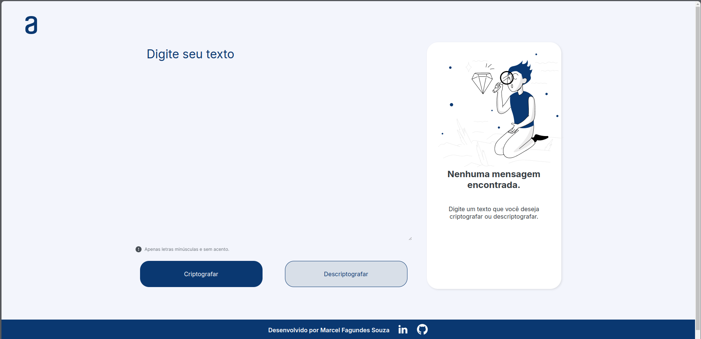

# Decodificador de Texto


## Índice

- [Descrição](#descrição)
- [Funcionalidades](#funcionalidades)
- [Screenshots](#screenshots)
- [Instalação](#instalação)
- [Uso](#uso)
- [Tecnologias Utilizadas](#tecnologias-utilizadas)
- [Contribuição](#contribuição)
- [Licença](#licença)

## Descrição

O Decodificador de Texto é um aplicativo web simples que permite criptografar e descriptografar mensagens de texto. Este projeto foi desenvolvido com HTML, CSS e JavaScript, e oferece uma interface amigável para que os usuários possam inserir um texto, criptografá-lo e, posteriormente, descriptografá-lo.

## Funcionalidades

- **Criptografar Texto**: Permite ao usuário inserir um texto e criptografá-lo.
- **Descriptografar Texto**: Permite ao usuário descriptografar o texto criptografado.
- **Validação de Entrada**: A entrada só aceita letras minúsculas e números, rejeitando caracteres especiais e letras maiúsculas.
- **Interface Responsiva**: Adapta-se a diversos tamanhos de tela, utilizando breakpoints CSS.
- **Copiar Texto**: O usuário pode copiar o texto descriptografado para a área de transferência.

## Screenshots

### Tela Inicial



### Texto Criptografado


### Texto Descriptografado


## Instalação

1. Clone o repositório para o seu ambiente local:
    ```sh
    git clone https://github.com/marcelfagundes/decodificador-texto.git
    ```

2. Navegue até o diretório do projeto:
    ```sh
    cd decodificador-texto
    ```

3. Abra o arquivo `index.html` no seu navegador.

## Uso

1. Abra o arquivo `index.html` no navegador.
2. Insira o texto que deseja criptografar na caixa de texto.
3. Clique no botão "Criptografar".
4. O texto criptografado será exibido na área de resultado.
5. Para descriptografar o texto, clique no botão "Descriptografar".
6. O texto descriptografado será exibido novamente na caixa de entrada.

## Tecnologias Utilizadas

- HTML5
- CSS3
- JavaScript

## Contribuição

Contribuições são bem-vindas! Por favor, siga os passos abaixo para contribuir:

1. Faça um fork do projeto.
2. Crie uma branch para sua feature (`git checkout -b feature/nova-feature`).
3. Commit suas mudanças (`git commit -am 'Adiciona nova feature'`).
4. Push para a branch (`git push origin feature/nova-feature`).
5. Abra um Pull Request.

## Licença

Este projeto está licenciado sob a [MIT License](LICENSE).

---

Desenvolvido por Marcel Fagundes Souza. Conecte-se comigo no [LinkedIn](https://linkedin.com/in/marcel-fagundes) e no [GitHub](https://github.com/marcelfagundes).
